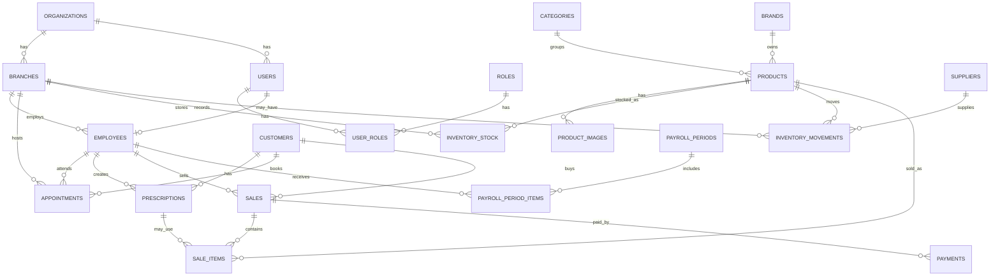

# Fase 2: Modelo de datos para web y CRM de optica

## Objetivo de la fase

Convertir el alcance de la fase 1 en un modelo de datos claro para construir la aplicacion en Next.js.

Esta fase define:

- Entidades principales.
- Relaciones entre entidades.
- Campos sugeridos por tabla.
- Estados y enums.
- Reglas de integridad.
- Recomendacion tecnica para base de datos, ORM y autenticacion.

## Decisiones base

- La base de datos recomendada es relacional.
- La primera version puede operar con una sola sucursal, pero el modelo incluye `branches` desde el inicio.
- Los productos fisicos se controlan mediante movimientos de inventario, no editando stock sin historial.
- Las recetas opticas se versionan: no se sobrescribe una receta historica.
- Una venta puede incluir productos, servicios o ambos.
- Nomina inicia como control administrativo interno, no como sistema fiscal completo.
- Los registros sensibles deben tener auditoria basica: fecha de creacion, fecha de actualizacion y usuario responsable cuando aplique.

## Stack tecnico recomendado

### Aplicacion

- Next.js con App Router.
- TypeScript.
- Tailwind CSS para interfaz.
- Componentes reutilizables para panel administrativo.

### Base de datos

- PostgreSQL.
- Prisma ORM.
- Migraciones versionadas con Prisma Migrate.

### Autenticacion

Opcion recomendada para MVP:

- Auth.js si se desea controlar la autenticacion dentro del proyecto.

Opcion alternativa:

- Supabase Auth si se quiere acelerar login, recuperacion de password y gestion de usuarios.

### Archivos e imagenes

Opciones:

- Supabase Storage.
- S3 compatible storage.
- Cloudinary para imagenes de productos.

### Validacion

- Zod para validar formularios y payloads.
- Reglas de permisos en capa de servidor.

## Convenciones de datos

- Usar IDs tipo UUID.
- Usar `created_at` y `updated_at` en tablas principales.
- Usar `deleted_at` para borrado logico en tablas criticas.
- Usar montos en decimal, no en float.
- Guardar moneda en ventas y pagos.
- Guardar telefono como texto, no como numero.
- Guardar SKU como texto unico por organizacion o sucursal, segun decision comercial.

## Diagrama general



## Entidades principales

### organizations

Representa la empresa u optica. Aunque el MVP tenga una sola optica, esta tabla ayuda a crecer si despues se agregan varias marcas, negocios o configuraciones.

Campos:

| Campo | Tipo | Requerido | Notas |
| --- | --- | --- | --- |
| id | uuid | si | Identificador principal |
| name | text | si | Nombre comercial |
| legal_name | text | no | Razon social si aplica |
| tax_id | text | no | RFC u otro identificador fiscal |
| default_currency | text | si | Ejemplo: MXN |
| timezone | text | si | Ejemplo: America/Mexico_City |
| phone | text | no | Telefono general |
| email | text | no | Correo general |
| website | text | no | Sitio publico |
| created_at | timestamp | si | Fecha de creacion |
| updated_at | timestamp | si | Fecha de actualizacion |

Relaciones:

- Una organizacion tiene muchas sucursales.
- Una organizacion tiene muchos usuarios.
- Una organizacion tiene productos, clientes, ventas y configuraciones.

### branches

Representa una sucursal fisica.

Campos:

| Campo | Tipo | Requerido | Notas |
| --- | --- | --- | --- |
| id | uuid | si | Identificador principal |
| organization_id | uuid | si | FK a organizations |
| name | text | si | Nombre de sucursal |
| code | text | si | Codigo corto, ejemplo: MATRIZ |
| phone | text | no | Telefono |
| email | text | no | Email |
| address_line_1 | text | no | Calle y numero |
| address_line_2 | text | no | Interior, colonia u otra referencia |
| city | text | no | Ciudad |
| state | text | no | Estado |
| postal_code | text | no | Codigo postal |
| country | text | no | Pais |
| is_active | boolean | si | Activa/inactiva |
| created_at | timestamp | si | Fecha de creacion |
| updated_at | timestamp | si | Fecha de actualizacion |

Reglas:

- `code` debe ser unico por organizacion.
- No se debe borrar una sucursal con ventas o inventario historico.

### users

Representa cuentas que pueden iniciar sesion.

Campos:

| Campo | Tipo | Requerido | Notas |
| --- | --- | --- | --- |
| id | uuid | si | Identificador principal |
| organization_id | uuid | si | FK a organizations |
| email | text | si | Login principal |
| name | text | si | Nombre visible |
| phone | text | no | Telefono |
| password_hash | text | depende | Solo si Auth.js local lo requiere |
| auth_provider_id | text | depende | Si se usa proveedor externo |
| status | enum user_status | si | active, inactive, suspended |
| last_login_at | timestamp | no | Ultimo acceso |
| created_at | timestamp | si | Fecha de creacion |
| updated_at | timestamp | si | Fecha de actualizacion |

Relaciones:

- Un usuario puede tener varios roles.
- Un usuario puede estar vinculado a un empleado.

Reglas:

- `email` debe ser unico por organizacion.
- Usuarios inactivos no pueden iniciar sesion.

### roles

Catalogo de roles internos.

Campos:

| Campo | Tipo | Requerido | Notas |
| --- | --- | --- | --- |
| id | uuid | si | Identificador principal |
| organization_id | uuid | si | FK a organizations |
| key | text | si | admin, seller, optometrist, inventory_manager, hr |
| name | text | si | Nombre legible |
| description | text | no | Descripcion |
| created_at | timestamp | si | Fecha de creacion |
| updated_at | timestamp | si | Fecha de actualizacion |

Reglas:

- `key` debe ser unico por organizacion.
- Los roles base se crean al inicializar la organizacion.

### user_roles

Relaciona usuarios con roles.

Campos:

| Campo | Tipo | Requerido | Notas |
| --- | --- | --- | --- |
| id | uuid | si | Identificador principal |
| user_id | uuid | si | FK a users |
| role_id | uuid | si | FK a roles |
| created_at | timestamp | si | Fecha de asignacion |

Reglas:

- La combinacion `user_id` + `role_id` debe ser unica.

### employees

Representa empleados, tengan o no acceso al sistema.

Campos:

| Campo | Tipo | Requerido | Notas |
| --- | --- | --- | --- |
| id | uuid | si | Identificador principal |
| organization_id | uuid | si | FK a organizations |
| branch_id | uuid | no | Sucursal principal |
| user_id | uuid | no | FK opcional a users |
| first_name | text | si | Nombre |
| last_name | text | si | Apellidos |
| email | text | no | Email |
| phone | text | no | Telefono |
| job_title | text | si | Puesto |
| hire_date | date | no | Fecha de ingreso |
| base_salary | decimal | no | Sueldo base por periodo |
| commission_rate | decimal | no | Porcentaje de comision si aplica |
| status | enum employee_status | si | active, inactive, terminated |
| created_at | timestamp | si | Fecha de creacion |
| updated_at | timestamp | si | Fecha de actualizacion |
| deleted_at | timestamp | no | Borrado logico |

Reglas:

- Un empleado puede no tener usuario si solo se registra para nomina.
- Un usuario no debe vincularse a mas de un empleado activo.

### customers

Representa clientes de la optica.

Campos:

| Campo | Tipo | Requerido | Notas |
| --- | --- | --- | --- |
| id | uuid | si | Identificador principal |
| organization_id | uuid | si | FK a organizations |
| first_name | text | si | Nombre |
| last_name | text | no | Apellidos |
| phone | text | si | Contacto principal |
| email | text | no | Email |
| birth_date | date | no | Fecha de nacimiento |
| address | text | no | Direccion libre para MVP |
| preferred_contact_method | enum contact_method | no | phone, whatsapp, email |
| notes | text | no | Notas internas |
| marketing_opt_in | boolean | si | Permiso para promociones |
| created_at | timestamp | si | Fecha de creacion |
| updated_at | timestamp | si | Fecha de actualizacion |
| deleted_at | timestamp | no | Borrado logico |

Relaciones:

- Un cliente tiene muchas recetas.
- Un cliente tiene muchas citas.
- Un cliente tiene muchas ventas.

Reglas:

- Debe existir al menos telefono o email.
- Se recomienda evitar duplicados por telefono dentro de la misma organizacion.

### prescriptions

Representa una receta optica historica.

Campos:

| Campo | Tipo | Requerido | Notas |
| --- | --- | --- | --- |
| id | uuid | si | Identificador principal |
| organization_id | uuid | si | FK a organizations |
| customer_id | uuid | si | FK a customers |
| optometrist_employee_id | uuid | no | FK a employees |
| appointment_id | uuid | no | FK a appointments |
| prescription_date | date | si | Fecha de receta |
| right_sphere | decimal | no | OD esfera |
| right_cylinder | decimal | no | OD cilindro |
| right_axis | int | no | OD eje, 0 a 180 |
| left_sphere | decimal | no | OI esfera |
| left_cylinder | decimal | no | OI cilindro |
| left_axis | int | no | OI eje, 0 a 180 |
| pupillary_distance | decimal | no | Distancia pupilar |
| addition | decimal | no | Adicion |
| diagnosis_notes | text | no | Observaciones clinico-opticas |
| version | int | si | Version de receta |
| is_active | boolean | si | Marca receta vigente |
| created_at | timestamp | si | Fecha de creacion |
| updated_at | timestamp | si | Fecha de actualizacion |

Reglas:

- No se debe sobrescribir una receta historica.
- Si se corrige o actualiza una receta, se crea una nueva version.
- `right_axis` y `left_axis` deben estar entre 0 y 180.
- Una receta siempre debe pertenecer a un cliente.

### appointments

Representa citas para examen visual o servicios.

Campos:

| Campo | Tipo | Requerido | Notas |
| --- | --- | --- | --- |
| id | uuid | si | Identificador principal |
| organization_id | uuid | si | FK a organizations |
| branch_id | uuid | si | FK a branches |
| customer_id | uuid | si | FK a customers |
| optometrist_employee_id | uuid | no | FK a employees |
| scheduled_start | timestamp | si | Fecha y hora de inicio |
| scheduled_end | timestamp | no | Fecha y hora de fin |
| reason | text | no | Motivo |
| status | enum appointment_status | si | Estado |
| source | enum appointment_source | si | web, phone, walk_in, internal |
| notes | text | no | Notas internas |
| created_by_user_id | uuid | no | FK a users |
| created_at | timestamp | si | Fecha de creacion |
| updated_at | timestamp | si | Fecha de actualizacion |

Reglas:

- Debe tener cliente, sucursal, fecha y estado.
- No se debe permitir `scheduled_end` menor o igual que `scheduled_start`.
- Una cita atendida puede generar una receta.

### categories

Catalogo de categorias de producto o servicio.

Campos:

| Campo | Tipo | Requerido | Notas |
| --- | --- | --- | --- |
| id | uuid | si | Identificador principal |
| organization_id | uuid | si | FK a organizations |
| name | text | si | Nombre |
| slug | text | si | URL amigable |
| type | enum category_type | si | product, service |
| parent_id | uuid | no | Categoria padre |
| is_active | boolean | si | Activa/inactiva |
| created_at | timestamp | si | Fecha de creacion |
| updated_at | timestamp | si | Fecha de actualizacion |

Reglas:

- `slug` debe ser unico por organizacion.

### brands

Catalogo de marcas.

Campos:

| Campo | Tipo | Requerido | Notas |
| --- | --- | --- | --- |
| id | uuid | si | Identificador principal |
| organization_id | uuid | si | FK a organizations |
| name | text | si | Nombre |
| slug | text | si | URL amigable |
| is_active | boolean | si | Activa/inactiva |
| created_at | timestamp | si | Fecha de creacion |
| updated_at | timestamp | si | Fecha de actualizacion |

Reglas:

- `slug` debe ser unico por organizacion.

### products

Representa productos fisicos y servicios vendibles.

Campos:

| Campo | Tipo | Requerido | Notas |
| --- | --- | --- | --- |
| id | uuid | si | Identificador principal |
| organization_id | uuid | si | FK a organizations |
| category_id | uuid | si | FK a categories |
| brand_id | uuid | no | FK a brands |
| sku | text | depende | Requerido para producto fisico |
| name | text | si | Nombre comercial |
| slug | text | si | URL amigable |
| description | text | no | Descripcion |
| product_type | enum product_type | si | frame, sunglasses, contact_lens, lens, treatment, accessory, service |
| barcode | text | no | Codigo de barras |
| model | text | no | Modelo |
| color | text | no | Color |
| size | text | no | Medida |
| material | text | no | Material |
| cost_price | decimal | no | Costo |
| sale_price | decimal | si | Precio de venta |
| tax_rate | decimal | no | Impuesto si aplica |
| track_inventory | boolean | si | Controla stock |
| reorder_point | int | no | Minimo sugerido |
| is_active | boolean | si | Disponible internamente |
| is_public | boolean | si | Visible en sitio publico |
| created_at | timestamp | si | Fecha de creacion |
| updated_at | timestamp | si | Fecha de actualizacion |
| deleted_at | timestamp | no | Borrado logico |

Reglas:

- Si `track_inventory` es verdadero, `sku` es obligatorio.
- `sku` debe ser unico por organizacion para productos fisicos.
- Los servicios pueden no tener SKU ni inventario.

### product_images

Imagenes de productos para catalogo.

Campos:

| Campo | Tipo | Requerido | Notas |
| --- | --- | --- | --- |
| id | uuid | si | Identificador principal |
| product_id | uuid | si | FK a products |
| url | text | si | URL del archivo |
| alt_text | text | no | Texto alternativo |
| sort_order | int | si | Orden |
| is_primary | boolean | si | Imagen principal |
| created_at | timestamp | si | Fecha de creacion |

Reglas:

- Un producto debe tener maximo una imagen principal.

### suppliers

Representa proveedores.

Campos:

| Campo | Tipo | Requerido | Notas |
| --- | --- | --- | --- |
| id | uuid | si | Identificador principal |
| organization_id | uuid | si | FK a organizations |
| name | text | si | Nombre |
| contact_name | text | no | Contacto |
| phone | text | no | Telefono |
| email | text | no | Email |
| address | text | no | Direccion |
| notes | text | no | Notas |
| is_active | boolean | si | Activo/inactivo |
| created_at | timestamp | si | Fecha de creacion |
| updated_at | timestamp | si | Fecha de actualizacion |

### inventory_stock

Existencia actual por producto y sucursal.

Campos:

| Campo | Tipo | Requerido | Notas |
| --- | --- | --- | --- |
| id | uuid | si | Identificador principal |
| organization_id | uuid | si | FK a organizations |
| branch_id | uuid | si | FK a branches |
| product_id | uuid | si | FK a products |
| quantity_on_hand | int | si | Existencia fisica |
| quantity_reserved | int | si | Apartados o pendientes |
| quantity_available | int | si | Calculado o mantenido |
| updated_at | timestamp | si | Ultima actualizacion |

Reglas:

- La combinacion `branch_id` + `product_id` debe ser unica.
- `quantity_available` debe ser `quantity_on_hand - quantity_reserved`.
- Ninguna cantidad debe ser negativa salvo que se permita venta sin stock, cosa no recomendada para MVP.

### inventory_movements

Historial de entradas, salidas y ajustes.

Campos:

| Campo | Tipo | Requerido | Notas |
| --- | --- | --- | --- |
| id | uuid | si | Identificador principal |
| organization_id | uuid | si | FK a organizations |
| branch_id | uuid | si | FK a branches |
| product_id | uuid | si | FK a products |
| supplier_id | uuid | no | FK a suppliers |
| movement_type | enum inventory_movement_type | si | purchase, sale, return, adjustment, transfer_in, transfer_out |
| quantity | int | si | Positivo para entrada, negativo para salida |
| unit_cost | decimal | no | Costo unitario |
| reason | text | no | Motivo |
| reference_type | text | no | sale, purchase, manual, transfer |
| reference_id | uuid | no | ID externo relacionado |
| created_by_user_id | uuid | no | FK a users |
| created_at | timestamp | si | Fecha del movimiento |

Reglas:

- Todo cambio de stock debe crear un movimiento.
- Las salidas por venta deben referenciar la venta o partida de venta.
- Ajustes manuales deben tener motivo.

### sales

Representa una venta, cotizacion o apartado.

Campos:

| Campo | Tipo | Requerido | Notas |
| --- | --- | --- | --- |
| id | uuid | si | Identificador principal |
| organization_id | uuid | si | FK a organizations |
| branch_id | uuid | si | FK a branches |
| customer_id | uuid | no | FK a customers |
| seller_employee_id | uuid | no | FK a employees |
| sale_number | text | si | Folio |
| status | enum sale_status | si | Estado comercial |
| currency | text | si | Ejemplo: MXN |
| subtotal | decimal | si | Suma antes de descuentos/impuestos |
| discount_total | decimal | si | Descuento total |
| tax_total | decimal | si | Impuestos |
| total | decimal | si | Total |
| paid_total | decimal | si | Pagado |
| balance_due | decimal | si | Pendiente |
| notes | text | no | Notas |
| confirmed_at | timestamp | no | Cuando descuenta inventario |
| cancelled_at | timestamp | no | Cuando se cancela |
| created_by_user_id | uuid | no | FK a users |
| created_at | timestamp | si | Fecha de creacion |
| updated_at | timestamp | si | Fecha de actualizacion |

Reglas:

- `sale_number` debe ser unico por sucursal.
- El inventario se descuenta cuando la venta cambia a estado confirmado.
- Una venta cancelada debe restaurar inventario si ya habia movimientos de salida.
- `balance_due` debe ser `total - paid_total`.

### sale_items

Partidas de una venta.

Campos:

| Campo | Tipo | Requerido | Notas |
| --- | --- | --- | --- |
| id | uuid | si | Identificador principal |
| sale_id | uuid | si | FK a sales |
| product_id | uuid | no | FK a products |
| prescription_id | uuid | no | FK a prescriptions |
| description | text | si | Descripcion congelada para historico |
| quantity | int | si | Cantidad |
| unit_price | decimal | si | Precio unitario |
| discount_amount | decimal | si | Descuento |
| tax_amount | decimal | si | Impuesto |
| line_total | decimal | si | Total de partida |
| fulfillment_status | enum fulfillment_status | si | pending, in_process, ready, delivered, cancelled |
| created_at | timestamp | si | Fecha de creacion |
| updated_at | timestamp | si | Fecha de actualizacion |

Reglas:

- Debe existir producto o descripcion manual.
- La descripcion y precio se guardan en la partida aunque el producto cambie despues.
- Una partida puede usar una receta si corresponde a lentes graduados.

### payments

Pagos asociados a una venta.

Campos:

| Campo | Tipo | Requerido | Notas |
| --- | --- | --- | --- |
| id | uuid | si | Identificador principal |
| organization_id | uuid | si | FK a organizations |
| sale_id | uuid | si | FK a sales |
| amount | decimal | si | Monto |
| currency | text | si | Moneda |
| payment_method | enum payment_method | si | cash, card, transfer, mixed, other |
| status | enum payment_status | si | pending, completed, refunded, cancelled |
| reference | text | no | Referencia bancaria o terminal |
| paid_at | timestamp | no | Fecha de pago |
| created_by_user_id | uuid | no | FK a users |
| created_at | timestamp | si | Fecha de creacion |
| updated_at | timestamp | si | Fecha de actualizacion |

Reglas:

- Solo pagos completados suman a `paid_total`.
- Reembolsos deben registrarse como estado o movimiento separado segun se implemente contabilidad.

### payroll_periods

Periodos de nomina interna.

Campos:

| Campo | Tipo | Requerido | Notas |
| --- | --- | --- | --- |
| id | uuid | si | Identificador principal |
| organization_id | uuid | si | FK a organizations |
| branch_id | uuid | no | FK a branches |
| start_date | date | si | Inicio |
| end_date | date | si | Fin |
| status | enum payroll_status | si | draft, reviewed, paid, cancelled |
| notes | text | no | Notas |
| created_by_user_id | uuid | no | FK a users |
| created_at | timestamp | si | Fecha de creacion |
| updated_at | timestamp | si | Fecha de actualizacion |

Reglas:

- `end_date` debe ser mayor o igual que `start_date`.
- No se debe editar libremente un periodo pagado.

### payroll_period_items

Detalle de pago por empleado dentro de un periodo.

Campos:

| Campo | Tipo | Requerido | Notas |
| --- | --- | --- | --- |
| id | uuid | si | Identificador principal |
| payroll_period_id | uuid | si | FK a payroll_periods |
| employee_id | uuid | si | FK a employees |
| base_salary | decimal | si | Sueldo base |
| commissions | decimal | si | Comisiones |
| bonuses | decimal | si | Bonos |
| deductions | decimal | si | Descuentos |
| gross_total | decimal | si | Total antes de descuentos |
| net_total | decimal | si | Total final |
| notes | text | no | Notas |
| created_at | timestamp | si | Fecha de creacion |
| updated_at | timestamp | si | Fecha de actualizacion |

Reglas:

- La combinacion `payroll_period_id` + `employee_id` debe ser unica.
- `net_total` debe ser `base_salary + commissions + bonuses - deductions`.

## Enums

### user_status

- active
- inactive
- suspended

### employee_status

- active
- inactive
- terminated

### contact_method

- phone
- whatsapp
- email

### appointment_status

- scheduled
- confirmed
- attended
- no_show
- cancelled

### appointment_source

- web
- phone
- walk_in
- internal

### category_type

- product
- service

### product_type

- frame
- sunglasses
- contact_lens
- lens
- treatment
- accessory
- service

### inventory_movement_type

- purchase
- sale
- return
- adjustment
- transfer_in
- transfer_out

### sale_status

- quote
- reserved
- confirmed
- paid
- in_process
- ready_for_pickup
- delivered
- cancelled

### fulfillment_status

- pending
- in_process
- ready
- delivered
- cancelled

### payment_method

- cash
- card
- transfer
- mixed
- other

### payment_status

- pending
- completed
- refunded
- cancelled

### payroll_status

- draft
- reviewed
- paid
- cancelled

## Reglas de integridad por modulo

### Seguridad y permisos

- Solo usuarios con rol `admin` pueden crear o desactivar usuarios internos.
- Roles como `seller`, `optometrist`, `inventory_manager` y `hr` deben limitarse por modulo.
- Toda accion critica debe guardar `created_by_user_id` o auditoria equivalente.

### Clientes

- No eliminar fisicamente clientes con ventas, recetas o citas.
- Permitir borrado logico si el negocio necesita ocultar al cliente en vistas comunes.
- Evitar duplicados por telefono y email cuando sea posible.

### Recetas

- Las recetas son historicas.
- Una receta asociada a una venta no debe borrarse.
- Si se necesita corregir, crear nueva version y marcar la anterior como no activa.

### Inventario

- No modificar stock directamente desde `inventory_stock` sin crear `inventory_movements`.
- Cada movimiento debe indicar producto, sucursal, cantidad, tipo y fecha.
- Las ventas confirmadas generan movimientos tipo `sale`.
- Las cancelaciones de ventas confirmadas generan movimientos tipo `return` o ajuste inverso.
- Los ajustes manuales deben exigir motivo.

### Ventas

- Una venta en estado `quote` no descuenta inventario.
- Una venta en estado `reserved` puede aumentar `quantity_reserved`.
- Una venta en estado `confirmed` o superior descuenta `quantity_on_hand`.
- Una venta `cancelled` no debe aceptar nuevos pagos.
- Los pagos completados actualizan `paid_total`.
- Si `paid_total` es mayor o igual a `total`, la venta puede pasar a `paid`.

### Citas

- Una cita debe tener cliente y sucursal.
- Una cita atendida puede generar una receta.
- Una cita cancelada no debe generar receta nueva.

### Nomina

- El modulo de nomina inicial es administrativo.
- Periodos pagados deben quedar bloqueados o requerir permiso de administrador para correcciones.
- Los calculos fiscales quedan fuera del MVP.

## Indices recomendados

Indices unicos:

- `organizations.name` si se desea evitar duplicados.
- `branches.organization_id + branches.code`.
- `users.organization_id + users.email`.
- `roles.organization_id + roles.key`.
- `user_roles.user_id + user_roles.role_id`.
- `products.organization_id + products.sku` para productos con inventario.
- `products.organization_id + products.slug`.
- `categories.organization_id + categories.slug`.
- `brands.organization_id + brands.slug`.
- `inventory_stock.branch_id + inventory_stock.product_id`.
- `sales.branch_id + sales.sale_number`.
- `payroll_period_items.payroll_period_id + payroll_period_items.employee_id`.

Indices de busqueda:

- `customers.organization_id + customers.phone`.
- `customers.organization_id + customers.email`.
- `appointments.branch_id + appointments.scheduled_start`.
- `sales.organization_id + sales.created_at`.
- `sales.customer_id`.
- `inventory_movements.product_id + inventory_movements.created_at`.
- `payments.sale_id`.

## Modelo MVP vs crecimiento posterior

### Tablas necesarias para MVP

- organizations
- branches
- users
- roles
- user_roles
- employees
- customers
- prescriptions
- appointments
- categories
- brands
- products
- product_images
- suppliers
- inventory_stock
- inventory_movements
- sales
- sale_items
- payments

### Tablas que pueden agregarse despues

- payroll_periods
- payroll_period_items
- sale_status_history
- appointment_reminders
- purchase_orders
- purchase_order_items
- customer_documents
- audit_logs
- product_variants
- loyalty_accounts
- invoices

## Propuesta de estructura Prisma

Cuando se cree el proyecto Next, la estructura recomendada es:

```text
prisma/
  schema.prisma
  migrations/
  seed.ts

src/
  app/
    (public)/
    (admin)/
    api/
  lib/
    auth/
    db/
    permissions/
    validations/
  modules/
    customers/
    products/
    inventory/
    sales/
    appointments/
    prescriptions/
    payroll/
```

## Orden recomendado de implementacion

1. Crear proyecto Next con TypeScript.
2. Configurar PostgreSQL.
3. Instalar y configurar Prisma.
4. Crear modelos base: organizations, branches, users, roles, user_roles.
5. Crear seed inicial con organizacion, sucursal y usuario administrador.
6. Implementar autenticacion.
7. Implementar clientes y recetas.
8. Implementar productos e inventario.
9. Implementar ventas y pagos.
10. Implementar citas.
11. Agregar reportes basicos.
12. Agregar nomina interna.

## Datos iniciales sugeridos

### Roles

- admin
- seller
- optometrist
- inventory_manager
- hr

### Categorias

- Armazones
- Lentes solares
- Lentes de contacto
- Micas
- Tratamientos
- Accesorios
- Servicios

### Sucursal inicial

- name: Matriz
- code: MATRIZ

### Estados iniciales

Usar los enums definidos en esta fase para evitar textos libres inconsistentes.

## Preguntas que deben cerrarse antes de la fase 3

- Cual sera el nombre comercial de la optica.
- Pais, moneda y zona horaria definitivos.
- Si habra una o varias sucursales desde el lanzamiento.
- Si se vendera en linea o solo se mostrara catalogo.
- Si se requiere factura fiscal desde la primera version.
- Si se usara lector de codigo de barras.
- Si las recetas deben imprimirse en PDF.
- Si se desea login para clientes o solo para personal interno.
- Donde se guardaran imagenes de productos.
- Si se usara Auth.js, Supabase Auth u otro proveedor.

## Entregables de la fase 2

- Modelo relacional inicial definido.
- Entidades y campos principales definidos.
- Enums de negocio definidos.
- Reglas de integridad definidas.
- Indices recomendados definidos.
- Stack tecnico recomendado definido.
- Orden de implementacion tecnico definido.

## Siguiente fase

La fase 3 debe crear la base tecnica del proyecto Next.

Entregables esperados de fase 3:

- Proyecto Next.js creado.
- TypeScript y Tailwind configurados.
- Estructura inicial de carpetas.
- Prisma configurado.
- Esquema inicial en `schema.prisma`.
- Seed inicial de roles, sucursal y usuario administrador.
- Primer layout publico y primer layout administrativo.
